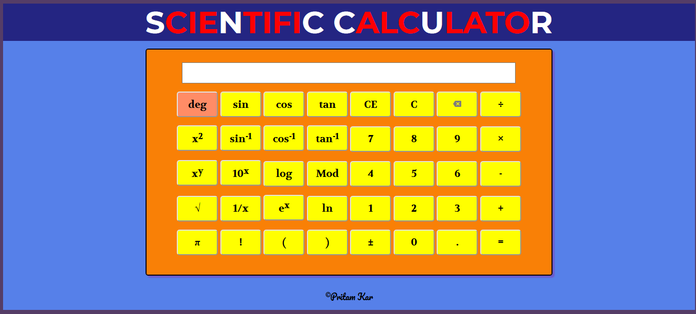

# Scientific Calculator
calculator to perform mathematical computations

# Resources Used

# About
- This is a simple scientific calculator made using the basic HTML,CSS & JS.
- You can perform trigonometric, exponential & logarithmic functions along with the normal arithmetic functions.

# Running the webpage
You can go the below given link to check out my webpage:

[https://mycalcnet.netlify.com]

# Screenshot

